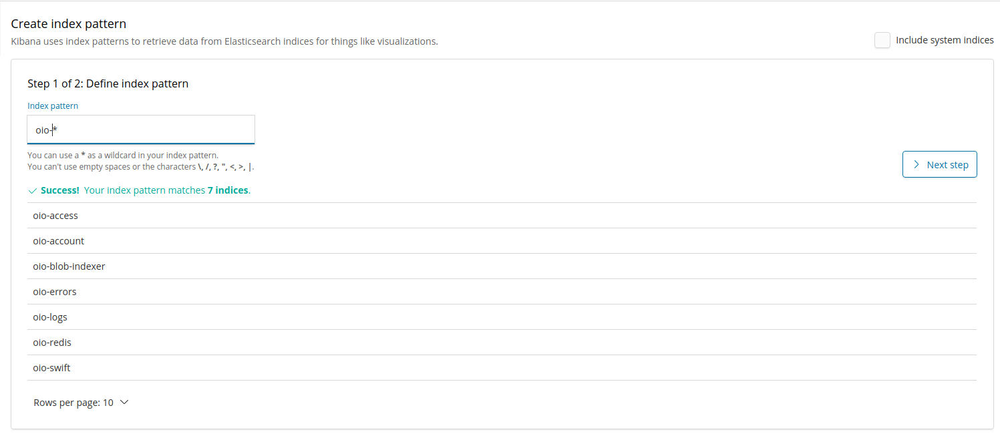
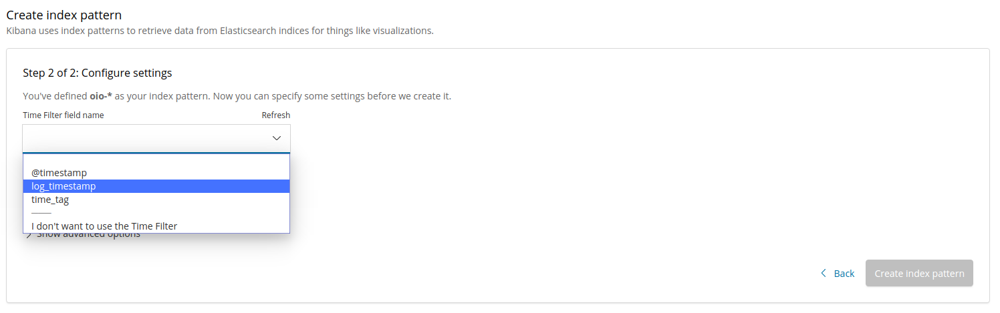
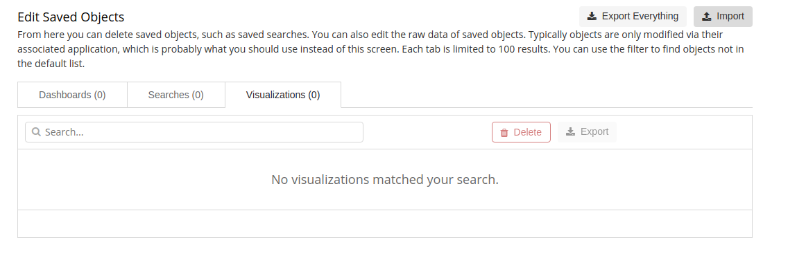
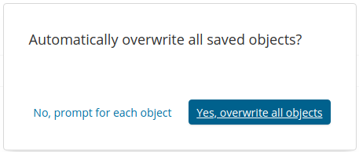
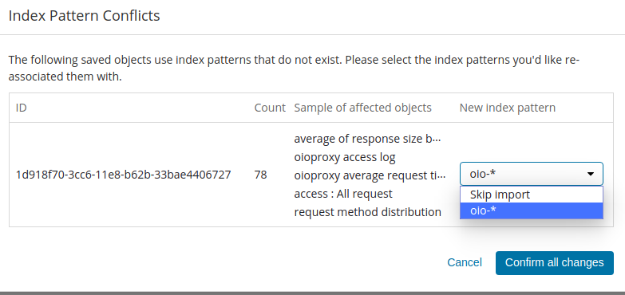

Docker ELK + FILEBEAT+ OPENIO/SDS    
----------------------

> les diiférentes versions des outils utilisés:  
- ELK : version 6.6.2   
- Filebeat : Version 6.6.2  
- Openio/sds: version 16.04


#### Requirement
 [Installer docker](https://docs.docker.com/install/)   
 [Installer docker-compose ](https://docs.docker.com/compose/install/)


 #### Clone the repository

 ```
 $ git clone https://github.com/papebadiane/docker-elkf
 ```


# Setup

 ```
 $ cd docker-elkf
 ```
#### Change log directory privileges
 To be able to share the log directory between the openio/sds container and our host machine, it is important to change the rights to allow the different services of the storage solution to be able to modify the log files. Without this it is not possible to launch the containers correctly.
 ```
 sudo find openio/log/ -type d -exec chmod 777 {} \;
 ```
 ```
 sudo find openio/log/ -type f -exec chmod 666 {} \;
 ```

#### increase host's virtual memory
  ```
  $ sudo sysctl -w vm.max_map_count=262144
  ```
# Run containers

 ```
 $ docker-compose up -d
 ```
 ____________________________________________________________________________________
# Import dashboards and visualizations
Before to import the dashboards and visualizations you need firstly to create a common index for all any log type openio services.
All index has like prefix `oio-`

## Create a index
1. Click on **Management** in left side
2. Click on **Index Pattern**
3. Define an index pattern

 Use the index pattern `oio-*` and click on **Next step**

 

4. Select **log_timestamp** field  and Click on **Create  index pattern**

   


## Import dashboards


1. Click on **Saved Objects**

 

2. Click on **Import**

 

3. Go to the directory where dashboards and visualizations are located and Select the file named **dashboard.json**
4. Click on "overwrite all objects"

 


## Import visualizations

1. Repeat the step 1 and 2 of **import dashboard**

2. Go to the directory where dashboards and visualizations are located and Select the file named **visualize.json**
3. Click on "overwrite all objects"



4. Select the index that you created




To visualize dashboards click on **dashboards** in the side navigation, and choose the one that you want.
___________________________________________________________________________________
# How manage data retention with Elastic curator

 In order to keep our infrastructures clean and to reduce the response time of requests, it is important to clean our indexes frequently, because they consume a lot of resources (CPU, RAM, disks).

 Elastic curator allows you to delete data according to certain characters, there are 2 ways to do this:

##### 1. Curator_cli

 - This next command permit to delete data older than 10 days

 ```
 $ curator_cli --host 127.0.0.1 delete_indices --filter_list '{"filtertype":"age","source":"creation_date","timestring":"%Y.%m.%d","unit":"days","unit_count":10,"direction":"older"}'

 ```
##### 2. Action file

The file `curator.yml` containing information about cluster elasticsearch

 ```
 ---
 # Remember, leave a key empty if there is no value.  None will be a string,
 # not a Python "NoneType"
 client:
   hosts:
     - 127.0.0.1
   port: 9200
   url_prefix:
   use_ssl: False
   certificate:
   client_cert:
   client_key:
   ssl_no_validate: False
   http_auth:
   timeout: 30
   master_only: False

 logging:
   loglevel: INFO
   logfile:
   logformat: default
   blacklist: ['elasticsearch', 'urllib3']

 ```
The file `delete_indices.yml` containing actions to do

 ```
 actions:
   1:
     action: delete_indices
     description: >-
       Delete indices older than 30 days based on oio- prefixed indices
     options:
       ignore_empty_list: True
       disable_action: True
     filters:
     - filtertype: pattern
       kind: prefix
       value: oio-
     - filtertype: age
       source: creation_date
       timestring: '%Y.%m.%d'
       unit: days
       unit_count: 30
       direction: older
   2:
     action: delete_indices
     description: >-
       Delete indices when space raise 100G, based on oio- prefixed indices.
     options:
       ignore_empty_list: True
       disable_action: True
     filters:
     - filtertype: space
       disk_space: 100
       use_age: True
       source: creation_date
     - filtertype: pattern
       kind: prefix
       value: oio-
 ```

```
 $ /usr/bin/curator ./delete_indices.yml --config ./curator.yml
```

#### Activate openio/sds log on container
```
 $ vi /etc/rsyslog.conf
```

Add the following line juste after the line containing "`$ModLoad imuxsock`"  
`input(type="imuxsock" Socket="/dev/log" CreatePath="on")`  


* Now restart services

```
$ gridinit_cmd restart

```
